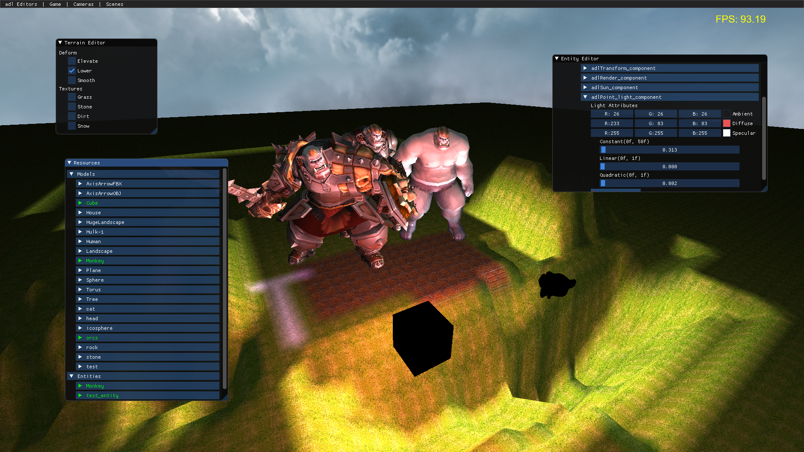

= ADL Game Engine

== 3D cross-platform game engine

ADL is a component based easy to use 3D RTS game engine. Uses OpenGL and runs on Windows and Linux.

=== Features

* **Graphics**
** OpenGL 4.2 based renderer
** Terrain painter
** Full model support for Blender, Maya etc via http://assimp.sourceforge.net/main_downloads.html[Assimp]
* ** Collision & Physics**
** Fully integrated physics engine https://github.com/bulletphysics/bullet3[Bullet]
* **Entity-Component System**
** Built-in components for rendering, physics and lighting
** Easy to create custom components

=== Build Instructions

==== Windows

**Prerequisites**

* https://cmake.org/download/[Cmake]
* https://visualstudio.microsoft.com/tr/downloads/[Visual Studio 2017]

Running build_scripts/Windows_visual_studio.bat generates a Visual Studio Solution file under build folder. If that failes most likely you are missing some dependencies. Check cmakes output for which ones you are missing and download them. 
Put include files under dependencies/[library_name]/include
Lib files under dependencies/[library_name]/lib
and dlls under dependencies/bin folder.

**Dependencies:**

* http://assimp.sourceforge.net/main_downloads.html[Assimp]
* https://www.freetype.org/download.html[Freetpye]
* http://glew.sourceforge.net/[GLEW]
* https://github.com/Tencent/rapidjson[RapidJSON]
* https://www.libsdl.org/download-2.0.php[SDL2]
* https://github.com/gabime/spdlog[spdlog]
* https://github.com/nothings/stb[stb]
* https://github.com/ocornut/imgui[ImGui]
* https://github.com/bulletphysics/bullet3[Bullet]
